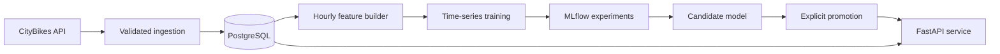

# Velib Demand Forecasting

[](https://github.com/zakilbaki/velib-demand-forecasting/actions/workflows/ci.yml)

End-to-end ML system that predicts the number of bikes available at a Paris Velib
station one hour ahead. The repository covers the full local lifecycle: live ingestion,
time-aware feature engineering, experiment tracking, model promotion, and API serving.

## Why this project

Bike availability is a short-horizon forecasting problem with direct operational value:
better predictions can support station rebalancing and give riders a more reliable view
of future availability. The project is designed as an engineering case study, not only a
modeling notebook.

## System architecture



| Layer | Implementation |
| --- | --- |
| Ingestion | CityBikes API client, validation, idempotent PostgreSQL writes |
| Features | Hourly station state, three lag values, deltas, calendar and location features |
| Modeling | `GradientBoostingRegressor` with time-series cross-validation |
| Tracking | MLflow parameters, metrics, runs, and model artifacts |
| Serving | Versioned model bundle, explicit promotion, FastAPI, Docker Compose |

## Results

The final evaluation uses a held-out chronological test period.

| Metric | Cross-validation | Test |
| --- | ---: | ---: |
| RMSE | 3.0244 | 2.8223 |
| MAE | 2.0670 | 1.9663 |
| R2 | 0.9325 | 0.9395 |

The served feature set contains current capacity, hour/weekend context, station
coordinates, three hourly lags, and one- and three-hour deltas. Experiment metadata is
stored alongside the promoted model under `serving_models/current/`.

## Repository structure

```text
src/
  ingestion/        API client, mapping, validation, persistence
  features/         supervised dataset and lag features
  training/         cross-validation and final evaluation
  serving/          model loading, promotion, feature reconstruction, API
init_sql/            PostgreSQL schema
notebooks/           exploratory analysis
serving_models/      promoted bundle and local candidates
tests/               ingestion and serving unit tests
```

## Run locally

Requirements: Python 3.12 and Docker Compose.

```bash
python -m venv .venv
source .venv/bin/activate
pip install -r requirements.txt
cp .env.example .env
docker compose up -d postgres
```

Ingest one live snapshot, then train and evaluate once enough history is available:

```bash
python -m src.main
python -m src.training.train_regression
python -m src.training.evaluate_regression
python -m src.serving.promote_model --run-id <run_id>
docker compose up -d --build api
```

The API is exposed at `http://127.0.0.1:8000`; interactive documentation is available
at `http://127.0.0.1:8000/docs`.

## API example

The low-level endpoint accepts an already-built feature vector:

```bash
curl -X POST http://127.0.0.1:8000/predict \
  -H 'Content-Type: application/json' \
  -d '{
    "free_bikes_current": 12,
    "empty_slots_current": 8,
    "hour_of_day": 18,
    "is_weekend": false,
    "latitude": 48.8566,
    "longitude": 2.3522,
    "free_bikes_t_minus_1": 11,
    "free_bikes_t_minus_2": 10,
    "free_bikes_t_minus_3": 9,
    "delta_1h": 1,
    "delta_3h": 3
  }'
```

For an operational request, `POST /predict/station-state` rebuilds lag and location
features from PostgreSQL before inference. `GET /health` reports whether a promoted
model is loaded.

## Quality checks

```bash
pip install -r requirements-dev.txt
ruff check --select E9,F63,F7,F82 src tests
pytest -q
```

GitHub Actions runs the same checks on every pull request.

